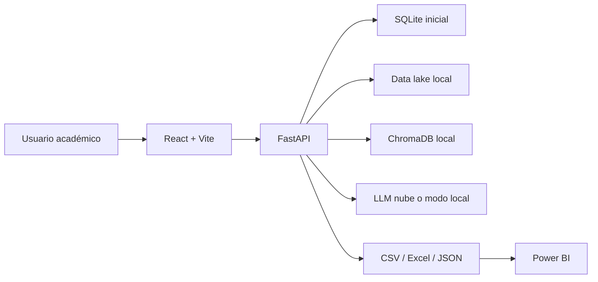

# Arquitectura General

## Propósito

LATAM EduAgent permite consultar en lenguaje natural datasets y documentos asociados a pruebas estatales latinoamericanas. La arquitectura separa backend, frontend, almacenamiento tabular, vectorización documental y exportación para Power BI.

## Componentes

## Backend

FastAPI expone endpoints para chat, carga de datasets, analítica, RAG, generación de evaluaciones y reportes. SQLAlchemy permite usar SQLite en la primera versión y PostgreSQL en una versión avanzada cambiando `DATABASE_URL`.

## Frontend

React ofrece una interfaz sencilla con cinco áreas: chat, datasets, análisis, reportes y evaluaciones. La comunicación se realiza con Axios.

## Datos

Los archivos originales se guardan en `data/raw`, los datos limpios en `data/processed`, los documentos en `data/documents`, los vectores en `data/chroma` y las exportaciones en `data/exports`.

## RAG

Los documentos se extraen, fragmentan, vectorizan e indexan en ChromaDB. Las respuestas documentales incluyen fuentes recuperadas.

## Modelo LLM

La solución usa un LLM preentrenado. Para la primera versión no se recomienda entrenar un modelo desde cero por costo, datos requeridos y complejidad de evaluación.
