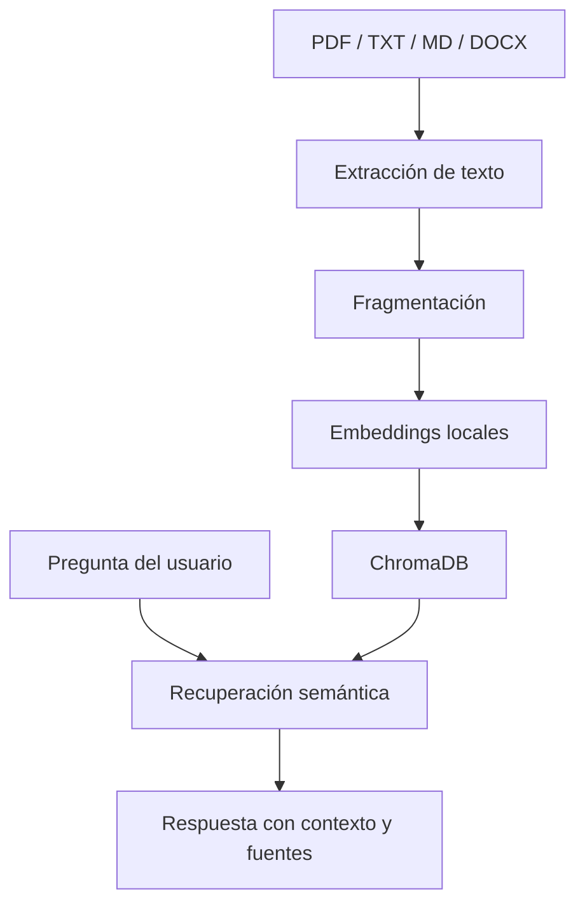

# Sistema RAG

## Objetivo

RAG permite responder sobre metodología, diccionarios de variables, informes técnicos y guías oficiales sin depender únicamente del conocimiento general del modelo.

## Flujo

## Implementación

Funciones principales:

- `upload_documents()`
- `extract_text()`
- `chunk_documents()`
- `retrieve_context()`
- `generate_answer_with_context()`

## Nota técnica

La versión académica usa embeddings determinísticos locales basados en hashing para evitar dependencias de API. En una versión avanzada se recomienda reemplazarlo por embeddings de OpenAI, Azure OpenAI, Sentence Transformers u otro proveedor especializado.
